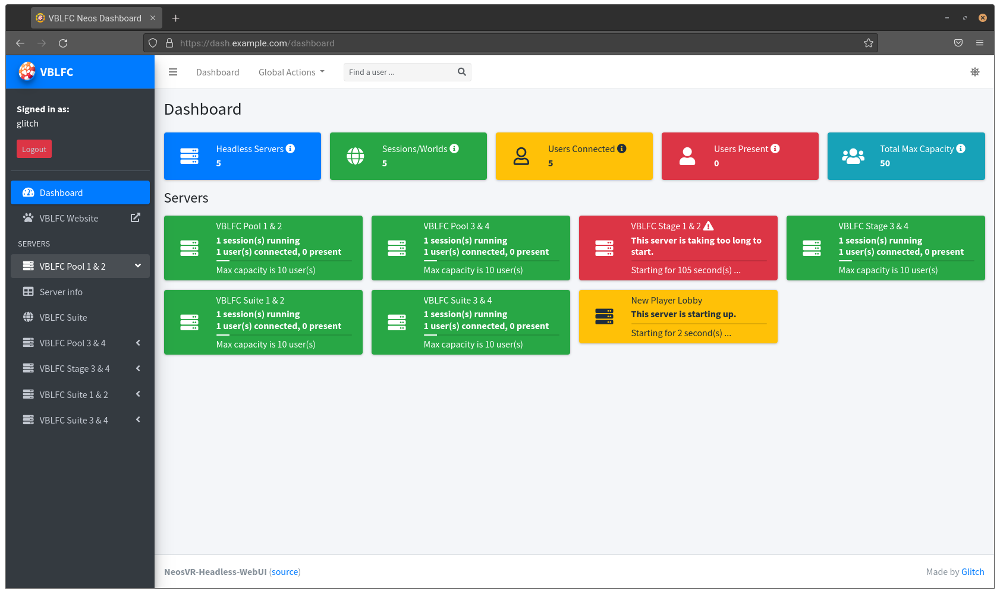

# NeosVR-Headless-WebUI

**NeosVR-Headless-WebUI** is a web dashboard that allows you to monitor and control one or several NeosVR [headless clients](https://wiki.neos.com/Headless_Client) simultaneously. The backend is powered by [Flask](https://flask.palletsprojects.com/) and uses [rpyc](https://rpyc.readthedocs.io/) to communicate with headless clients remotely using [NeosVR-Headless-API](https://github.com/glitchfur/NeosVR-Headless-API).

## Features

- Monitor total number of headless clients, sessions, and users
- Attractive administrative interface allowing you to perform most headless client actions
- Search for users across all headless client sessions
- Frozen headless client detection - allows you to kill stuck headless clients or restart them in place
- Multi user login and access
- Run and control headless clients on remote machines

## Installation

You can get started quickly by running the web app as a Docker container (easier) or by manually setting everything up yourself (more difficult and currently undocumented). See the [wiki](https://github.com/glitchfur/NeosVR-Headless-WebUI/wiki) for installation and configuration steps. The Docker image can be used to control headless clients that are _not_ containerized as well.

## License

This project uses the [GNU GPLv3](/LICENSE.txt) license.
